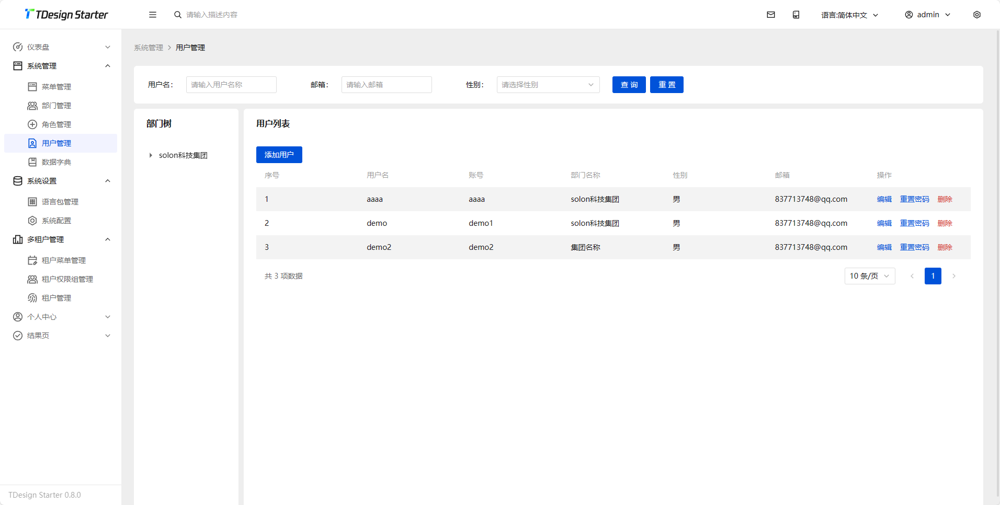

<h1 align="center" style="margin: 30px 0 30px; font-weight: bold;">Murky v0.1.0</h1>
<h4 align="center">以solon + mybatis-flex + satoken为基础的脚手架,用于快速开发项目,基于satoken实现了RBAC权限模型的分布式架构,同时支持saas和对saas权限的管理,实现各种国际化为互联网出海助力</h4>

目前系统仍在开发中,所以不提供演示地址,欢迎贡献代码

### 系统简介

1. 基于MIT协议完整开源
2. 前端采用[TDesign](https://tdesign.tencent.com/vue-next/overview)模板适配
3. 前端技术栈:vue3 + vite + pina
4. 后端技术栈:solon + mybaits-flex + satoken + DamiBus
5. 数据库使用postgresql,redis
6. jdk支持默认21,可低成本兼容到17(修改pom中的javaversion,修改main中使用的虚拟线程池)
7. 系统内置了国际化功能,采用了字典+国际化语言包数据化的管理方式,可以自由拓展需要的语言

### 技术选型

**为什么使用[solon](http://solon.noear.org/)**:
solon是一款国产的生态框架同时兼容jdk8、jdk11、jdk17、jdk20,相比springboot拥有更小的包体积，更小的内存占用，更快的启动速度,目前jar文件大小仅13M左右

**为什么使用[mybaitis-flex](https://mybatis-flex.com/)**: 采用APT技术而不是反射而拥有了更强大的性能,使用QueryWrap无sql模式更加得心应手,可以轻易的迁移至其他数据库

**什么是[DamiBus](https://gitee.com/noear/dami?_from=gitee_search)**: damiBus是一款是专为本地多模块之间通讯解耦而设计,通过他可以让模块间高度解耦

**为什么使用pgsql**: 开源免费,社区强大,性能卓越,通过schema能够低成本的完成saas

### 系统模块

~~~
cn.murky     
├── murky-ui
│       └── murky-admin      // 前端管理端
│       └── murky-saas       // 前端商户端
├── murky-common        // 通用模块
├── murky-admin         // 管理端服务端模块
│       └── main                                      // 启动类
│       └── murky-admin-auth                   // 管理端权限模块 
│       └── murky-admin-library                // 管理端依赖库
│                   └── murky-admin-common             // 管理端通用模块
│                   └── murky-admin-core               // 管理端核心模块
│                   └── murky-admin-flex               // 管理端 mybats-flex 模块
│                   └── murky-admin-security           // 管理端 satoken 安全模块
│       └── murky-admin-saas                   // 管理端租户管理模块
│       └── murky-admin-system                 // 管理端系统管理模块
├── murky-library       // 抽象通用库
│       └── murky-common                       // 抽象公共库
│       └── murky-core                         // 抽象核心库
│       └── murky-flex                         // 抽象mybats-flex库
├── murky-saas          // 商户端服务端模块
├── pom.xml             // 公共依赖管理声明
~~~

### 开发计划

| 功能规划   | 管理端 | saas端 |
|--------|-----|-------|
| 文字国际化  | 开发中 | 规划中   |
| 多租户管理  | 开发中 | ----- |
| 页面     | 开发中 | 规划中   |
| 数据级权限  | 已完成 | 规划中   |
| 密码加密   | 已完成 | 规划中   |
| 接口数据脱敏 | 规划中 | 规划中   |
| 代码生成   | 规划中 | 规划中   |
| 时间国际化  | 规划中 | 规划中   |

#### 文件上传
solon对文件上传做了一些抽象,所以使用不同的文件服务替换很简单,如果需要加入,可以参考文档[http://solon.noear.org/article/family-solon-cloud-file](http://solon.noear.org/article/family-solon-cloud-file)

### 安装教程

1. 部署数据库运行sql脚本
2. 根据需求选择引入redis或者使用单体
3. 前端运行npm install ,npm run dev运行
4. 后端修改main中的配置文件即可直接运行

### 页面展示

### 参与贡献

1. Fork 本仓库
2. 新建 Feat_xxx 分支
3. 提交代码
4. 新建 Pull Request
